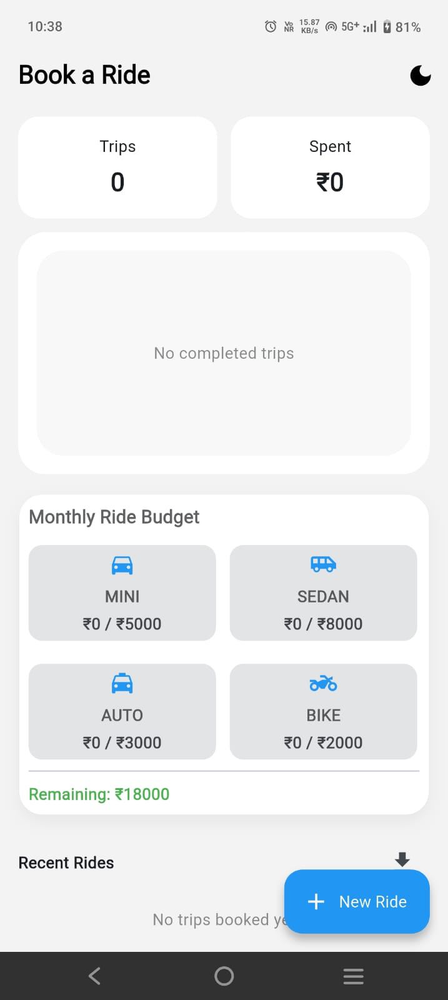
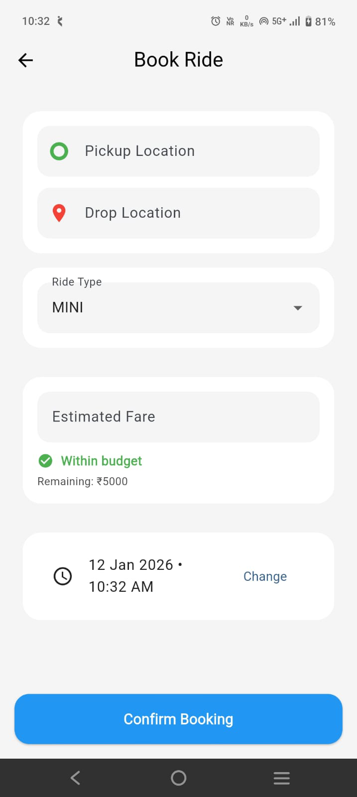
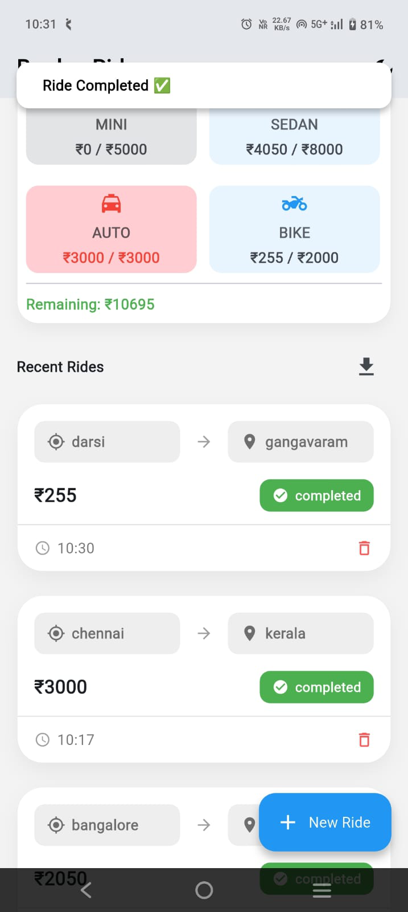
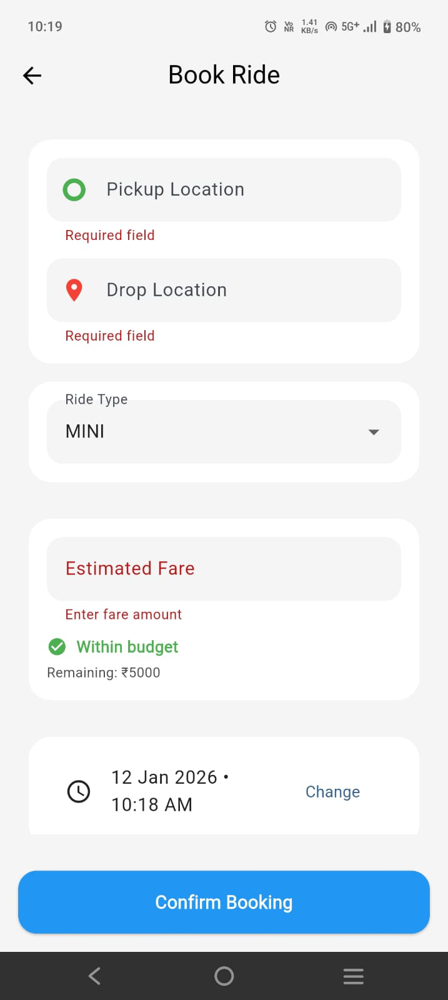
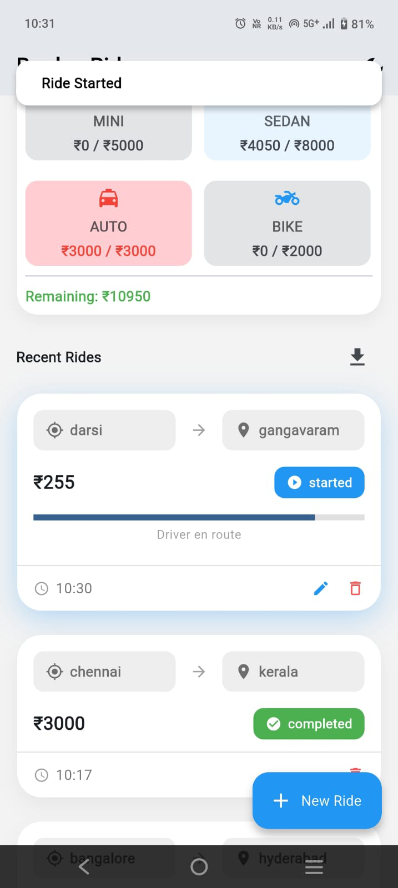
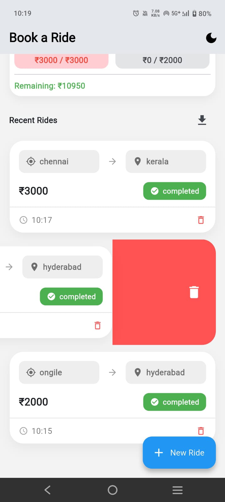
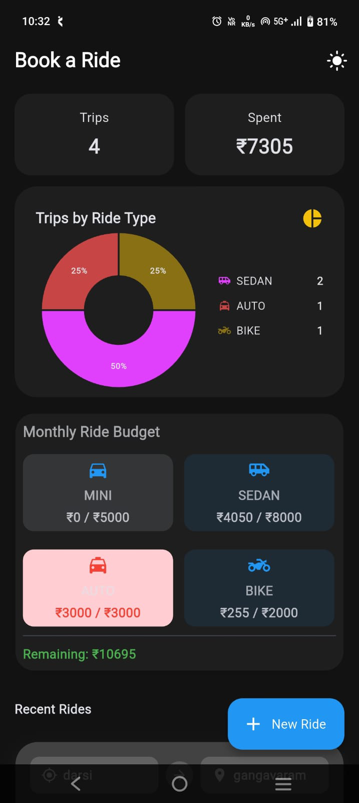
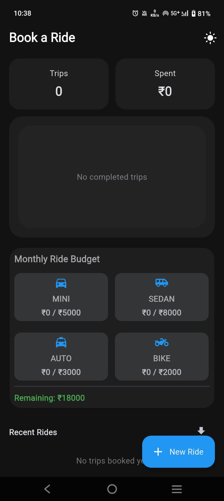
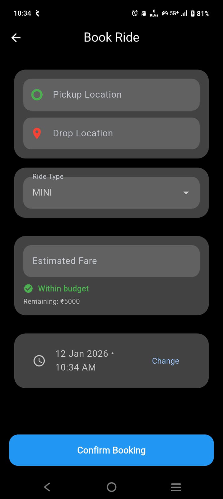

# Smart Ride Booking & Trip Management App

A Flutter application that simulates a real-time ride booking system (similar to Ola/Uber) with offline storage, live status updates, analytics, and spending limits.

---

##  Features

### Dashboard
- Total trips completed
- Total amount spent
- Recent trips list
- Pie chart showing trips by ride type
- Real-time updates when trips are added or completed

### Trips (Bookings)
- Add, edit, delete trips
- Ride types: Mini, Sedan, Auto, Bike
- Live ride status simulation:
    - Requested
    - Driver Assigned
    - Started
    - Completed
    - Cancelled
- Offline storage using Hive

### Ride Spending Limits
- Monthly spending limit per ride type
- Real-time recalculation when ride completes
- Color-coded alerts for exceeded budgets

### Real-Time Simulation
- Automatic ride status progression using timers
- Live fare updates (mocked)
- Mock driver movement & ETA updates
- In-app notifications for ride events

### UI / UX
- Responsive mobile UI
- Light & Dark mode
- Smooth animations for status and fare updates

---

## 🛠 Tech Stack
- Flutter 3.x
- Dart
- Riverpod (StateNotifier)
- Hive (offline storage)
- fl_chart (charts)

---

##  Architecture
Feature-first clean architecture with clear separation of concerns:

- UI (screens & widgets)
- State management using Riverpod StateNotifier
- Models for business entities
- Services for Hive storage and ride simulation

---

## ⚡ Setup / Installation

1. Clone the repository (if not already on your machine):
   ```bash
   git clone https://github.com/sushma-star/smatr_ride_booking.git
   cd smatr_ride_booking
## Screenshots
 

### Light Theme

**Empty Dashboard**  


**Ride Creation**  


**Ride Confirmation Message**  


**Ride Creation Form Validation**  


**Ride Request Message**  


**Ride Start Message**  


**Swipe to Delete**  


---

### Dark Theme

**Dashboard**  


**Empty Dashboard**  


**Ride Creation Form**  


**Ride History**  

